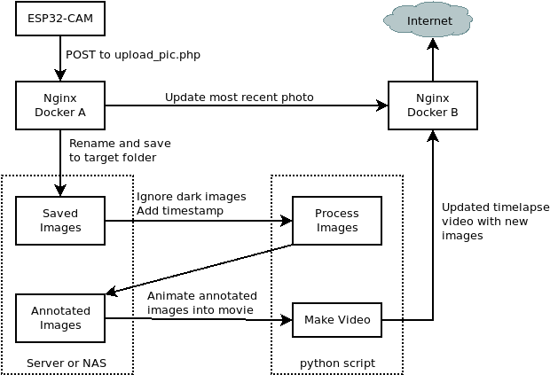

# esp32cam-timelapse

[Demo Site](https://garden.muffalings.com/)

## Overview

This repo contains template files to use to set up an ESP32-CAM to take a picture with a set frequency, upload it to a server, compile the captured images into a timelapse movie, and then host it via a webserver. The files in this repo will not work as-is and will need to be customized depending on your deployment environment. Specifically, the four components of this repo are: 

1. First, there is code to be flashed onto an ESP32-CAM that triggers it to take an image periodically and upload it to a web address. 
2. Second, I have php code to be hosted on the destination server of the ESP32-CAM that recieves the image, renames it, and saves it in a target folder.
3. Third, there is a python script to make a timelapse video from the images saved in the upload directory while screening out any images that are very dark (such as overnight).
4. Fourth, there is php for a front end server to host the most recent image taken by the camera as well as serving the timelapse video.

These steps in diagram form can be seen below.

More info about the inspiration for this as well as some troubleshooting steps, check out Robot Zero's [post](https://robotzero.one/time-lapse-esp32-cameras/) and [repo](https://github.com/robotzero1/esp32cam-timelapse).

## ESP32-CAM

The included sketch can be found in the `esp32-src` folder and is named `timelapse-server.ino`. It is a slightly modified version of the sketch found [here](https://github.com/robotzero1/esp32cam-timelapse/blob/master/timelapse-server.ino). There are a couple things that you will want to tweak for your own purposes. 

1. First, the time interval between images
2. Second, the location of your script to handle uploaded images
3. Your wifi SSID information

## Upload Server

This is server-side code to handle the incoming images coming from the ESP32-CAM. The php code to do this can be found in the `server-upload` folder at `upload_pic.php`. In my environment, I use dockerized nginx as a webserver, and have this php in the server root directory. There are two variables you will want to change to fit your own implementation.

1. `$upload_path` is the folder that will store all the uploaded images.
2. `$latest_path` is the path at which the most recent image taken by the ESP32-CAM will be saved. This image will be overwritten as each new image is uploaded.

The script is configured to name each image that is uploaded according to the timestamp at which they are uploaded. This is later used by the python script when the timelapse movie is put together.

## Annotation and Movie Creation

In the `timelapse-maker` folder, there is an example python script of how to parse the uploaded images and put them together into a timelapse movie as an `.mp4` file. There are a couple things that will need to be set to make this script work.

1. Line 47: `input_dir` will need to be set to be the path to the folder that contains all the images that have been saved by the above upload server. The script expects the filename to follow the same timestamp convention as the php from that server.
2. Line 48: `output_dir` will need to be set to a folder where annotated images are saved. The python script will put a timestamp in the upper left of each image as white text on a black background and save a copy in this folder.
3. Line 49: `output_video` will need to be set to the path at which you want to save the completed timelapse video as an `.mp4` file.

An important thing that you will need to supply in the same folder as `make_timelapse.py` is the font file that should be used for annotations. The correct file, `FreeMono.ttf`, can be found [here](https://github.com/opensourcedesign/fonts/blob/master/gnu-freefont_freemono/FreeMono.ttf). Just save this file and make sure it is in the same directory.

In my environment, I made a bash script to run this python program each hour so that the timelapse is kept up to date automatically.

## Front End Webserver

The final component is a webserver to serve both the latest picture and the compiled timelapse movie in a webpage. The `webserver-frontend` folder contains an example `index.php` file that grabs the most recent image from the ESP32-CAM and then displays it along with the timelapse. There is at least one thing you will need to tweak.

1. You will need to set the `$url` variable in `index.php` to point to the same webserver you upload images to. This grabs the most recently captured image from the ESP32-CAM by way of the `latest.jpg` image on the server.

In my environment, this webserver is a dockerized nginx webserver that is separate from the nginx instance that handles image uploads. This server is then exposed to the web.